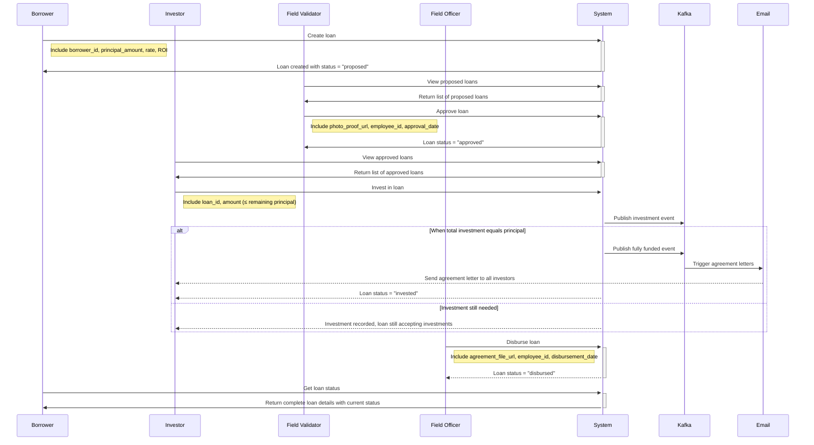

# AMF Loan Service

A comprehensive loan engine backend service built with Go, Gin framework, and clean architecture principles.

## Overview

This service manages a peer-to-peer lending platform with four main user types:

- **Borrowers**: Create loan requests
- **Investors**: Invest in approved loans
- **Field Validators**: Approve loan applications after field verification
- **Field Officers**: Disburse funds to borrowers

## System Architecture

The system implements **Clean Architecture** with the following layers:

- **Domain**: Core business logic, entities, and interfaces
- **Service**: Business use cases and orchestration
- **Infrastructure**: External dependencies (database, Kafka, email)
- **Handlers**: HTTP request/response handling
- **Routes**: API endpoint definitions

## Loan State Machine

Loans progress through four states:

1. **Proposed** → Initial state when loan is created
2. **Approved** → After field validation with proof
3. **Invested** → When total investments equal loan principal
4. **Disbursed** → When funds are given to borrower

State transitions only move forward and include validation rules.

## Key Features

- **JWT Authentication** with role-based access control
- **Event-driven architecture** using Kafka for investment processing
- **Email notifications** for agreement letters
- **PostgreSQL** database with GORM
- **RESTful API** design
- **Docker containerization**
- **Postman collection** for easy API testing

## Quick Start

1. **Setup Infrastructure**:

   ```bash
   ./scripts/start-infra.sh
   ```

2. **Create Mock Users**:

   ```bash
   make mock-users
   ```

3. **Run Application**:

   ```bash
   make run
   ```

4. **Test with Postman**:
   - Import `AMF-Loan-Service.postman_collection.json`
   - Set `base_url` to `http://localhost:8080`
   - Use login endpoints to authenticate

## Mock User Accounts

After running `make mock-users`, you'll have these test accounts:

**Borrowers:**

- `borrower1@example.com` (John Doe)
- `borrower2@example.com` (Alice Johnson)
- `borrower3@example.com` (Bob Smith)

**Investors:**

- `investor1@example.com` (Emma Wilson)
- `investor2@example.com` (Michael Brown)
- `investor3@example.com` (Sarah Davis)
- `investor4@example.com` (David Lee)
- `investor5@example.com` (Lisa Martinez)

**Staff:**

- `validator@amf.com` (Field Validator)
- `officer@amf.com` (Field Officer)

All passwords are `password123` (staff use `validator123`/`officer123`)

## API Endpoints

### Authentication

```
POST /api/auth/login     - User login
```

### Loans

```
GET    /api/loans              - List loans (filtered by user role)
POST   /api/loans              - Create loan (borrowers only)
GET    /api/loans/{id}         - Get loan details
POST   /api/loans/{id}/approve - Approve loan (field validators only)
POST   /api/loans/{id}/disburse - Disburse loan (field officers only)
```

### Investments

```
POST /api/investments           - Invest in loan (investors only)
GET  /api/investments/my        - Get my investments (investors only)
GET  /api/loans/{id}/investments - Get loan investments
```

### Health Check

```
GET /health - Service health status
```

## Installation

### Prerequisites

- Go 1.21+
- PostgreSQL 15+
- Apache Kafka
- Docker & Docker Compose (optional)

### Using Docker (Recommended)

1. Clone the repository:

```bash
git clone <repository-url>
cd amf-loan-service
```

2. Copy environment file:

```bash
cp .env.example .env
```

3. Start infrastructure services:

```bash
./scripts/start-infra.sh
```

4. Create mock users:

```bash
go run cmd/create-mock-users/main.go
```

5. Run the application:

```bash
go run cmd/server/main.go
```

### Using Make Commands

```bash
# Install dependencies
make deps

# Build the application
make build

# Run the application
make run

# Run tests
make test

# Docker operations
make docker-build
make docker-run
make docker-stop
```

## Configuration

Set the following environment variables in `.env`:

```env
# Database
DB_HOST=localhost
DB_USER=postgres
DB_PASSWORD=password
DB_NAME=loan_service
DB_PORT=5432

# JWT
JWT_SECRET=your-super-secret-key
JWT_EXPIRY=24h

# Kafka
KAFKA_BROKERS=localhost:9092
KAFKA_INVESTMENT_TOPIC=investment_processing
KAFKA_FULLY_FUNDED_TOPIC=loan_fully_funded

# SMTP
SMTP_HOST=smtp.gmail.com
SMTP_PORT=587
SMTP_USERNAME=your-email@gmail.com
SMTP_PASSWORD=your-app-password

# API
API_PORT=8080
```

## Usage Examples

### Postman Collection

For easy API testing, import the provided Postman collection:

```
AMF-Loan-Service.postman_collection.json
```

The collection includes:

- All API endpoints with proper authentication
- Pre-configured environment variables
- Auto-token extraction from login responses
- Complete workflow examples for all user roles

### cURL Examples

#### Register a User

```bash
curl -X POST http://localhost:8080/api/auth/register \
  -H "Content-Type: application/json" \
  -d '{
    "email": "borrower@example.com",
    "password": "password123",
    "role": "borrower"
  }'
```

### Create a Loan

```bash
curl -X POST http://localhost:8080/api/loans \
  -H "Content-Type: application/json" \
  -H "Authorization: Bearer YOUR_JWT_TOKEN" \
  -d '{
    "principal_amount": 10000,
    "rate": 12.5,
    "roi": 10.0
  }'
```

### Invest in a Loan

```bash
curl -X POST http://localhost:8080/api/investments \
  -H "Content-Type: application/json" \
  -H "Authorization: Bearer YOUR_JWT_TOKEN" \
  -d '{
    "loan_id": "loan-uuid-here",
    "amount": 5000
  }'
```

## Project Structure

```
├── cmd/
│   └── server/
│       └── main.go              # Application entry point
├── internal/
│   ├── config/
│   │   └── config.go            # Configuration management
│   ├── domain/
│   │   ├── entities.go          # Core entities and DTOs
│   │   ├── interfaces.go        # Repository and service interfaces
│   │   └── errors.go            # Domain errors
│   ├── infrastructure/
│   │   ├── database/
│   │   │   └── postgres.go      # Database connection and migrations
│   │   ├── kafka/
│   │   │   └── producer.go      # Kafka message producer
│   │   ├── email/
│   │   │   └── service.go       # Email notification service
│   │   └── repository/
│   │       ├── user_repository.go
│   │       ├── loan_repository.go
│   │       └── other_repositories.go
│   ├── service/
│   │   ├── auth_service.go      # Authentication business logic
│   │   ├── loan_service.go      # Loan management business logic
│   │   ├── investment_service.go # Investment business logic
│   │   └── notification_service.go # Email notification logic
│   ├── handlers/
│   │   ├── auth_handler.go      # Authentication HTTP handlers
│   │   ├── loan_handler.go      # Loan HTTP handlers
│   │   └── investment_handler.go # Investment HTTP handlers
│   ├── middleware/
│   │   └── auth.go              # JWT and role-based middleware
│   └── routes/
│       └── routes.go            # API route definitions
├── docker-compose.yml           # Infrastructure services
├── Dockerfile                   # Application containerization
├── Makefile                     # Build and development commands
├── go.mod                       # Go module definition
└── README.md                    # This file
```

## Business Rules

### Loan Approval

- Requires field validator role
- Must include photo proof URL
- Must include validator employee ID and approval date
- Cannot revert to proposed state once approved

### Investment Processing

- Only investors can invest
- Cannot invest in own loans (borrowers)
- Investment amount cannot exceed remaining loan balance
- Automatically transitions loan to "invested" when fully funded
- Publishes Kafka events for investment processing and fully funded loans

### Loan Disbursement

- Requires field officer role
- Loan must be in "invested" state
- Must include signed agreement file URL
- Must include officer employee ID and disbursement date

## Event Processing

The system uses Kafka for asynchronous event processing:

### Investment Topic (`investment_processing`)

Triggered when any investment is made, containing:

- Investment details
- Loan information
- Investor data

### Fully Funded Topic (`loan_fully_funded`)

Triggered when a loan reaches full funding, containing:

- Complete loan details
- All investor information
- Triggers agreement letter email distribution

## Security

- **JWT tokens** for authentication with configurable expiry
- **Bcrypt hashing** for password storage
- **Role-based access control** for API endpoints
- **HTTPS ready** with proper headers

## Testing

```bash
# Run all tests
go test ./...

# Run tests with coverage
go test -coverprofile=coverage.out ./...
go tool cover -html=coverage.out
```

## Contributing

1. Fork the repository
2. Create a feature branch
3. Implement changes with tests
4. Submit a pull request

## License

This project is licensed under the MIT License.

## System Flow Diagram


