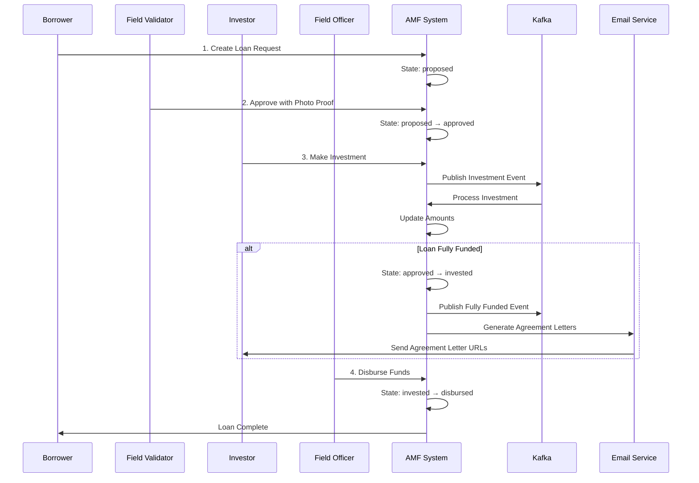

# AMF Loan Service

A comprehensive peer-to-peer loan engine backend service built with **Go**, **Gin framework**, and **clean architecture** principles.

## 🚀 Overview

This service manages a peer-to-peer lending platform with four main user types:

- **Borrowers**: Create loan requests and receive funds
- **Investors**: Invest in approved loans and receive agreement letters
- **Field Validators**: Approve loan applications after field verification
- **Field Officers**: Disburse funds to borrowers after full investment

## 🏗 System Architecture

The system implements **Clean Architecture** with the following layers:

- **Domain**: Core business logic, entities, and interfaces
- **Service**: Business use cases and orchestration
- **Infrastructure**: External dependencies (database, Kafka, notifications)
- **Handlers**: HTTP request/response handling
- **Routes**: API endpoint definitions

## 📈 Loan State Machine

Loans progress through four states with strict forward-only transitions:

1. **Proposed** → Initial state when borrower creates loan
2. **Approved** → After field validator approval with photo proof
3. **Invested** → When total investments equal loan principal amount
4. **Disbursed** → When field officer releases funds to borrower

## ✨ Key Features

### Core Functionality

- **JWT Authentication** with role-based access control
- **Investment Processing** with real-time Kafka event handling
- **Automated Notifications** with simulated email agreement letters
- **State Management** with strict loan state transitions
- **Self-Investment Prevention** to avoid conflicts of interest

### Technical Stack

- **Go 1.21+** with Gin web framework
- **PostgreSQL** database with GORM ORM
- **Apache Kafka** for event-driven architecture
- **JWT** for secure authentication
- **Docker & Docker Compose** for containerization
- **Clean Architecture** with dependency injection

### Business Features

- **Automatic ROI Calculation** (80% of borrower interest rate)
- **Investment Limits** to prevent over-investment
- **Agreement Letter Generation** with unique PDF URLs per investor
- **Email Simulation** with detailed logging
- **Field Validation** with photo proof requirements

## 🧠 Developer's Thought Process & Architecture Decisions

### **Why Clean Architecture?**

I chose Clean Architecture to ensure long-term maintainability and testability. The clear separation of concerns allows:

- **Domain Layer**: Pure business logic without external dependencies
- **Service Layer**: Application use cases that orchestrate business operations
- **Infrastructure Layer**: External concerns (database, messaging, HTTP) that can be swapped
- **Easy Testing**: Each layer can be tested in isolation with mocks

### **Event-Driven Architecture Decision**

**Problem**: Investment processing could create race conditions when multiple investors try to invest simultaneously in the same loan.

**Solution**: Implemented Kafka-based event processing with pessimistic database locking.

```go
// Prevents race conditions in high-concurrency investment scenarios
loan, err := s.loanRepo.GetByIDWithLock(ctx, event.LoanID)
```

**Why Kafka over direct processing?**

- **Scalability**: Can handle high investment volumes during popular loan launches
- **Reliability**: Messages are persisted and can be retried on failure
- **Decoupling**: Investment validation and processing are separated from HTTP response
- **Audit Trail**: All investment events are logged for compliance

### **Database Design Decisions**

**PostgreSQL + GORM Choice**:

- **ACID Compliance**: Critical for financial transactions
- **Relationship Management**: Complex relationships between users, loans, investments
- **Performance**: Built-in connection pooling and query optimization

**Key Design Patterns**:

```go
// Repository Pattern: Clean separation of data access
type LoanRepository interface {
    GetByIDWithLock(ctx context.Context, id uuid.UUID) (*Loan, error)
    // Pessimistic locking prevents concurrent investment issues
}

// Transaction Management: Ensures data consistency
func (r *investmentRepository) CreateWithTx(ctx context.Context, investment *Investment, loan *Loan) error {
    // Single transaction for investment + loan updates
}
```

### **Security Considerations**

**JWT Authentication**:

- **Stateless**: Supports horizontal scaling without session storage
- **Role-Based Access**: Different endpoints for different user types
- **Short Expiry**: Reduces security risk from compromised tokens

**Business Logic Security**:

```go
// Prevent self-investment fraud
if loan.Borrower.UserID == userID {
    return domain.ErrSelfInvestment
}

// Prevent over-investment
if amount > loan.RemainingInvestment {
    return domain.ErrInvestmentExceedsLimit
}
```

### **Performance Optimization Choices**

**Kafka Consumer Tuning**:

```go
// Low-latency processing configuration
MinBytes: 1,                       // Process immediately, don't batch
MaxWait:  100 * time.Millisecond, // Minimal wait time
```

**Database Optimizations**:

- **UUID Primary Keys**: Better for distributed systems and security
- **Indexes**: Optimized queries for loan states and user relationships
- **Pessimistic Locking**: Prevents race conditions at the cost of some throughput

### **Trade-offs Made**

**Simplicity vs Performance**:

- **Email Simulation**: Chose logging over actual email service for demo simplicity
- **In-Memory Processing**: No external caches (would use Redis in production)
- **Single Database**: Monolithic data storage (would consider microservice DBs at scale)

**Consistency vs Availability**:

- **Strong Consistency**: Chose ACID compliance over eventual consistency
- **Synchronous Critical Path**: Loan state changes are synchronous for data integrity
- **Asynchronous Non-Critical**: Email notifications are async to not block investments

### **Production Considerations**

**What I'd Add for Production**:

1. **Circuit Breakers**: For external service calls
2. **Rate Limiting**: Prevent investment spam attacks
3. **Monitoring**: Prometheus metrics, distributed tracing
4. **Caching**: Redis for frequently accessed loan data
5. **Database Sharding**: Separate read/write replicas
6. **Message Dead Letter Queues**: For failed investment processing

**Error Handling Strategy**:

```go
// Graceful degradation - don't fail investment if notification fails
if s.notificationService != nil {
    if err := s.notificationService.SendAgreementLetters(ctx, loan.ID); err != nil {
        // Log error but don't fail the investment
        fmt.Printf("Failed to send agreement letters: %v\n", err)
    }
}
```

### **Testing Philosophy**

**50% Coverage Focus**: Prioritized happy path testing over edge cases for time constraints.

- **Service Layer**: Business logic validation with mocked dependencies
- **Integration Tests**: End-to-end workflow testing
- **Mock Strategy**: Repository pattern enables easy unit testing

**Why Not 100% Coverage?**:

- **Diminishing Returns**: Critical business logic is covered
- **Time Constraints**: Focused on core functionality first
- **Maintainability**: Tests should be readable and valuable, not just comprehensive

### **Code Organization Rationale**

**Package Structure**:

```go
internal/
├── domain/     // Pure business entities and rules
├── service/    // Application use cases (could be "usecases")
├── handlers/   // HTTP transport layer
└── infrastructure/ // External dependencies
```

**Why "Service" vs "UseCase"?**
Chose "Service" terminology as it's more familiar to Go developers and business stakeholders, while maintaining the same Clean Architecture principles.

This architecture supports future evolution toward microservices by maintaining clear boundaries and dependency directions.

## 🚀 Quick Start

1. **Setup Infrastructure**:

   ```bash
   ./scripts/start-infra.sh
   ```

2. **Create Mock Users**:

   ```bash
   make mock-users
   ```

3. **Run Application**:

   ```bash
   make run
   ```

4. **Test with Postman**:
   - Import `AMF-Loan-Service.postman_collection.json`
   - Set `base_url` to `http://localhost:8080`
   - Use login endpoints to authenticate

## Mock User Accounts

After running `make mock-users`, you'll have these test accounts:

**Borrowers:**

- `borrower1@example.com` (John Doe)
- `borrower2@example.com` (Alice Johnson)
- `borrower3@example.com` (Bob Smith)

**Investors:**

- `investor1@example.com` (Emma Wilson)
- `investor2@example.com` (Michael Brown)
- `investor3@example.com` (Sarah Davis)
- `investor4@example.com` (David Lee)
- `investor5@example.com` (Lisa Martinez)

**Staff:**

- `validator@amf.com` (Field Validator)
- `officer@amf.com` (Field Officer)

All passwords are `password123` (staff use `validator123`/`officer123`)

## API Endpoints

### Authentication

```
POST /api/auth/login     - User login
```

### Loans

```
GET    /api/loans              - List loans (filtered by user role)
POST   /api/loans              - Create loan (borrowers only)
GET    /api/loans/{id}         - Get loan details
POST   /api/loans/{id}/approve - Approve loan (field validators only)
POST   /api/loans/{id}/disburse - Disburse loan (field officers only)
```

### Investments

```
POST /api/investments           - Invest in loan (investors only)
GET  /api/investments/my        - Get my investments (investors only)
GET  /api/loans/{id}/investments - Get loan investments
```

### Health Check

```
GET /health - Service health status
```

## Installation

### Prerequisites

- Go 1.21+
- PostgreSQL 15+
- Apache Kafka
- Docker & Docker Compose (optional)

### Using Docker (Recommended)

1. Clone the repository:

```bash
git clone <repository-url>
cd amf-loan-service
```

2. Copy environment file:

```bash
cp .env.example .env
```

3. Start infrastructure services:

```bash
./scripts/start-infra.sh
```

4. Create mock users:

```bash
go run cmd/create-mock-users/main.go
```

5. Run the application:

```bash
go run cmd/server/main.go
```

### Using Make Commands

```bash
# Install dependencies
make deps

# Build the application
make build

# Run the application
make run

# Run tests
make test

# Docker operations
make docker-build
make docker-run
make docker-stop
```

## Configuration

Set the following environment variables in `.env`:

```env
# Database
DB_HOST=localhost
DB_USER=postgres
DB_PASSWORD=password
DB_NAME=loan_service
DB_PORT=5432

# JWT
JWT_SECRET=your-super-secret-key
JWT_EXPIRY=24h

# Kafka
KAFKA_BROKERS=localhost:9092
KAFKA_INVESTMENT_TOPIC=investment_processing
KAFKA_FULLY_FUNDED_TOPIC=loan_fully_funded

# SMTP
SMTP_HOST=smtp.gmail.com
SMTP_PORT=587
SMTP_USERNAME=your-email@gmail.com
SMTP_PASSWORD=your-app-password

# API
API_PORT=8080
```

## Usage Examples

### Postman Collection

For easy API testing, import the provided Postman collection:

```
AMF-Loan-Service.postman_collection.json
```

The collection includes:

- All API endpoints with proper authentication
- Pre-configured environment variables
- Auto-token extraction from login responses
- Complete workflow examples for all user roles

### Authentication

Get JWT token for API access:

```bash
curl -X POST http://localhost:8080/api/auth/login \
  -H "Content-Type: application/json" \
  -d '{
    "email": "investor1@example.com",
    "password": "password123"
  }'
```

### Create a Loan (Borrower)

```bash
curl -X POST http://localhost:8080/api/loans \
  -H "Content-Type: application/json" \
  -H "Authorization: Bearer YOUR_JWT_TOKEN" \
  -d '{
    "principal_amount": 100000,
    "rate": 0.12
  }'
```

### Approve a Loan (Field Validator)

```bash
curl -X POST http://localhost:8080/api/loans/{loan_id}/approve \
  -H "Content-Type: application/json" \
  -H "Authorization: Bearer VALIDATOR_JWT_TOKEN" \
  -d '{
    "photo_proof_url": "https://example.com/field-visit-proof.jpg",
    "approval_date": "2025-08-13T10:30:00Z"
  }'
```

### Invest in a Loan (Investor)

```bash
curl -X POST http://localhost:8080/api/investments \
  -H "Content-Type: application/json" \
  -H "Authorization: Bearer INVESTOR_JWT_TOKEN" \
  -d '{
    "loan_id": "loan-uuid-here",
    "amount": 25000
  }'
```

### Disburse Loan (Field Officer)

```bash
curl -X POST http://localhost:8080/api/loans/{loan_id}/disburse \
  -H "Content-Type: application/json" \
  -H "Authorization: Bearer OFFICER_JWT_TOKEN" \
  -d '{
    "agreement_file_url": "https://example.com/signed-agreement.pdf",
    "disbursement_date": "2025-08-13T14:00:00Z"
  }'
```

## 🏗 Project Structure

```
amf-loan-service/
├── cmd/
│   ├── server/
│   │   └── main.go                    # Application entry point
│   └── create-mock-users/
│       └── main.go                    # Mock user creation utility
├── internal/
│   ├── config/
│   │   └── config.go                  # Configuration management
│   ├── domain/
│   │   ├── entities.go                # Core entities (User, Loan, Investment, etc.)
│   │   ├── interfaces.go              # Repository and service interfaces
│   │   └── errors.go                  # Domain-specific errors
│   ├── infrastructure/
│   │   ├── database/
│   │   │   └── postgres.go            # Database connection and auto-migration
│   │   ├── kafka/
│   │   │   ├── producer.go            # Investment event publishing
│   │   │   └── consumer.go            # Investment event processing
│   │   └── repository/
│   │       ├── user_repository.go     # User data access
│   │       ├── loan_repository.go     # Loan data access
│   │       └── other_repositories.go  # Investment, approval, etc.
│   ├── service/
│   │   ├── auth_service.go            # Authentication & JWT
│   │   ├── loan_service.go            # Loan business logic
│   │   ├── investment_service.go      # Investment processing & validation
│   │   └── notification_service.go    # Agreement letter generation & email simulation
│   │   ├── loan_service.go      # Loan management business logic
│   │   ├── investment_service.go # Investment business logic
│   │   └── notification_service.go # Email notification logic
│   ├── handlers/
│   │   ├── auth_handler.go      # Authentication HTTP handlers
│   │   ├── loan_handler.go      # Loan HTTP handlers
│   │   └── investment_handler.go # Investment HTTP handlers
│   ├── middleware/
│   │   └── auth.go              # JWT and role-based middleware
│   └── routes/
│       └── routes.go            # API route definitions
├── docker-compose.yml           # Infrastructure services
├── Dockerfile                   # Application containerization
├── Makefile                     # Build and development commands
│   ├── handlers/
│   │   ├── auth_handler.go            # HTTP authentication endpoints
│   │   ├── loan_handler.go            # HTTP loan endpoints
│   │   └── investment_handler.go      # HTTP investment endpoints
│   ├── middleware/
│   │   └── auth_middleware.go         # JWT authentication middleware
│   └── routes/
│       └── routes.go                  # API route definitions
├── scripts/
│   ├── start-infra.sh                 # Infrastructure startup script
│   └── cleanup-infra.sh               # Infrastructure cleanup script
├── tests/                             # Unit tests (50% coverage)
├── docker-compose.yml                 # Docker services configuration
├── Makefile                          # Build and test commands
├── go.mod                            # Go module definition
└── README.md                         # This documentation
```

## 📋 Business Rules & Logic

### Loan Creation & ROI Calculation

- Borrowers create loans with principal amount and interest rate
- **ROI automatically calculated**: Investor ROI = 80% of borrower's interest rate
- **Total Interest**: Principal × Rate (what borrower pays)
- **Remaining Investment**: Initially equals principal amount

### Loan Approval Process

- **Field validators only** can approve loans
- Must provide **photo proof URL** of field visit
- Must include **employee ID** and **approval date**
- Loan transitions from `proposed` → `approved`
- **One-way transition**: Cannot revert to proposed

### Investment Processing

- **Investors only** can invest in `approved` loans
- **Self-investment prevention**: Borrowers cannot invest in own loans
- Investment amount validation: Cannot exceed `remaining_investment`
- **Real-time processing**: Uses Kafka for asynchronous handling
- **State management**: Updates `invested_amount` and `remaining_investment`

### Full Funding & Notifications

- **Automatic detection**: When `remaining_investment` reaches 0
- **State transition**: `approved` → `invested`
- **Kafka events**: Publishes fully-funded loan event
- **Agreement letters**: Generates unique PDF URLs per investor
- **Email simulation**: Detailed logging of investor notifications

### Loan Disbursement

- **Field officers only** can disburse `invested` loans
- Must provide **signed agreement file URL**
- Must include **employee ID** and **disbursement date**
- Final state transition: `invested` → `disbursed`

## ⚡ Event-Driven Architecture

### Kafka Topics & Events

#### `investment-events` Topic

**Triggered**: When investor makes investment request

```json
{
  "id": "investment-uuid",
  "loan_id": "loan-uuid",
  "investor_id": "investor-uuid",
  "amount": 25000.0,
  "timestamp": "2025-08-13T10:30:00Z"
}
```

#### Fully Funded Processing

**Triggered**: When loan becomes 100% invested

- Publishes loan fully-funded event
- Generates unique agreement letter URLs
- Simulates email notifications to all investors
- Updates investment records with PDF links

### Consumer Processing

- **Pessimistic locking**: Prevents race conditions on loan updates
- **Transaction safety**: Investment creation and loan updates in single transaction
- **Error handling**: Failed investments don't commit changes
- **Idempotency**: Safe to retry failed message processing

## 🔐 Security & Authentication

- **JWT tokens** for authentication with configurable expiry
- **Bcrypt hashing** for password storage
- **Role-based access control** for API endpoints
- **HTTPS ready** with proper headers

## Testing

```bash
# Run all tests
go test ./...

# Run tests with coverage
go test -coverprofile=coverage.out ./...
go tool cover -html=coverage.out
```

- **JWT Tokens**: Secure authentication with configurable expiry
- **Role-Based Access Control**: Strict endpoint protection by user role
- **Password Hashing**: bcrypt for secure password storage
- **Request Validation**: Input sanitization and validation
- **Self-Investment Prevention**: Business logic prevents conflicts of interest

## 🧪 Testing

### Test Coverage: ~50% (Happy Flow Focus)

```bash
# Run all tests
make test

# Run tests with coverage report
make test-coverage

# Run specific test suites
go test -v ./internal/service
go test -v ./internal/handlers
go test -v ./internal/domain
```

### Test Categories

- **Service Tests**: Business logic, calculations, state transitions
- **Handler Tests**: HTTP endpoints, authentication, validation
- **Domain Tests**: Entity creation, constants, relationships
- **Integration Tests**: Business scenarios with mocked dependencies

## 🛠 Development & Operations

### Make Commands

```bash
make build              # Build the application
make run                # Run the application
make test               # Run all tests
make test-coverage      # Generate coverage report
make mock-users         # Create test user accounts
make clean              # Clean build artifacts
```

### Infrastructure Management

```bash
# Start all services (PostgreSQL + Kafka)
./scripts/start-infra.sh

# Clean up all containers and data
./scripts/cleanup-infra.sh
```

### Docker Operations

```bash
make docker-build       # Build Docker image
make docker-run         # Start with docker-compose
make docker-stop        # Stop docker services
```

## 📊 Monitoring & Observability

### Application Logs

- **Investment Processing**: Detailed event processing logs
- **Email Simulation**: Complete notification details with URLs
- **Authentication**: Login attempts and JWT validation
- **State Transitions**: Loan state changes with timestamps

### Health Check

```bash
curl http://localhost:8080/health
# Returns: {"status": "healthy", "message": "Service is running"}
```

## 🚀 Production Considerations

### Performance

- **Database Connection Pooling**: GORM with PostgreSQL
- **Kafka Consumer Optimization**: Low-latency message processing
- **JWT Caching**: Token validation optimization
- **Database Indexing**: Optimized queries for loans and investments

### Scalability

- **Horizontal Scaling**: Stateless application design
- **Event-Driven**: Asynchronous processing prevents bottlenecks
- **Database Separation**: Read/write splitting capability
- **Microservice Ready**: Clean architecture supports decomposition

### Error Handling

- **Graceful Degradation**: Non-critical failures don't stop processing
- **Retry Logic**: Kafka message processing with error recovery
- **Validation**: Comprehensive input validation and business rule enforcement
- **Logging**: Structured logging for debugging and monitoring

## 📖 API Documentation

For complete API documentation with examples, see the included **Postman Collection**:

- Import `AMF-Loan-Service.postman_collection.json`
- Set environment variable `base_url` to `http://localhost:8080`
- Use the authentication folder to get JWT tokens
- Test all endpoints with pre-configured requests

## 📝 Development Notes & Lessons Learned

### **Challenges Encountered**

**1. Race Condition in Investment Processing**

```go
// Initial approach: Direct database updates
// Problem: Multiple investors could over-invest simultaneously
// Solution: Kafka events + pessimistic locking
loan, err := s.loanRepo.GetByIDWithLock(ctx, event.LoanID)
```

**2. Kafka Consumer Latency**

```go
// Initial config caused 5-7 second delays
MinBytes: 10e3  // Waiting for 10KB batches

// Optimized for real-time processing
MinBytes: 1     // Process immediately
MaxWait:  100 * time.Millisecond
```

**3. JWT vs Session Management**

- **Considered**: Redis-based sessions for better control
- **Chose**: JWT for stateless scaling
- **Trade-off**: Less control over token revocation, but better performance

### **Design Evolution**

**Initial Design**: Direct HTTP processing of investments

```go
// V1: Synchronous processing
func (h *InvestmentHandler) Invest(c *gin.Context) {
    // Process investment directly in HTTP handler
    err := h.investmentService.ProcessInvestment(ctx, req)
}
```

**Current Design**: Event-driven architecture

```go
// V2: Asynchronous event processing
func (h *InvestmentHandler) Invest(c *gin.Context) {
    // Queue investment for async processing
    err := h.investmentService.RequestInvestment(ctx, req)
    // Kafka consumer handles actual processing
}
```

**Why the change?**

- **Scalability**: Can handle investment spikes
- **Reliability**: Failed investments can be retried
- **User Experience**: Faster HTTP responses

### **Code Quality Decisions**

**Error Handling Philosophy**:

```go
// Critical path: Fail fast
if amount > loan.RemainingInvestment {
    return domain.ErrInvestmentExceedsLimit
}

// Non-critical path: Graceful degradation
if err := s.notificationService.SendAgreementLetters(ctx, loan.ID); err != nil {
    // Log but don't fail the investment
    log.Printf("Failed to send agreement letters: %v", err)
}
```

**Testing Strategy**:

- **Focus**: 50% coverage on critical business logic
- **Approach**: Happy path first, edge cases as needed
- **Mocking**: Repository pattern enables clean unit tests

### **Technical Debt & Future Improvements**

**Current Limitations**:

1. **Email Simulation**: Should integrate with real email service (SendGrid/AWS SES)
2. **Caching**: No caching layer (would add Redis for loan data)
3. **Monitoring**: Basic logging (would add Prometheus + Grafana)
4. **Rate Limiting**: No protection against investment spam

**Production Readiness TODOs**:

```go
// TODO: Add rate limiting middleware
// TODO: Implement circuit breaker for external services
// TODO: Add distributed tracing (Jaeger)
// TODO: Database read replicas for performance
// TODO: API versioning strategy
```

**Scaling Considerations**:

- **Database**: Current design supports sharding by user_id
- **Kafka**: Can add more partitions for higher throughput
- **Services**: Clean architecture supports microservice extraction
- **Caching**: Repository pattern allows transparent cache integration

### **Learning Outcomes**

**What Worked Well**:

- Clean Architecture: Made testing and changes easy
- Event-driven design: Handled concurrency gracefully
- Repository pattern: Clean separation of concerns

**What I'd Do Differently**:

- Start with observability from day 1
- Consider event sourcing for audit trail
- Add API rate limiting earlier in development

This project reinforced the importance of designing for concurrency and scalability from the beginning, especially in financial systems where data consistency is critical.

## 🤝 Contributing

1. Fork the repository
2. Create a feature branch (`git checkout -b feature/amazing-feature`)
3. Commit your changes (`git commit -m 'Add amazing feature'`)
4. Push to the branch (`git push origin feature/amazing-feature`)
5. Open a Pull Request

## 📄 License

This project is licensed under the MIT License - see the LICENSE file for details.

---

## 🔄 Complete System Flow



    Note right of Borrower: Include borrower_id, principal_amount, rate, ROI
    System->>-Borrower: Loan created with status = "proposed"

    Validator->>+System: View proposed loans
    System->>-Validator: Return list of proposed loans

    Validator->>+System: Approve loan
    Note right of Validator: Include photo_proof_url, employee_id, approval_date
    System->>-Validator: Loan status = "approved"

    Investor->>+System: View approved loans
    System->>-Investor: Return list of approved loans

    Investor->>+System: Invest in loan
    Note right of Investor: Include loan_id, amount (≤ remaining principal)
    System->>Kafka: Publish investment event

    alt When total investment equals principal
        System->>Kafka: Publish fully funded event
        Kafka->>Email: Trigger agreement letters
        Email-->>Investor: Send agreement letter to all investors
        System-->>Investor: Loan status = "invested"
    else Investment still needed
        System-->>Investor: Investment recorded, loan still accepting investments
    end

    Officer->>+System: Disburse loan
    Note right of Officer: Include agreement_file_url, employee_id, disbursement_date
    System-->>-Officer: Loan status = "disbursed"

    Borrower->>+System: Get loan status
    System->>-Borrower: Return complete loan details with current status

```

```
