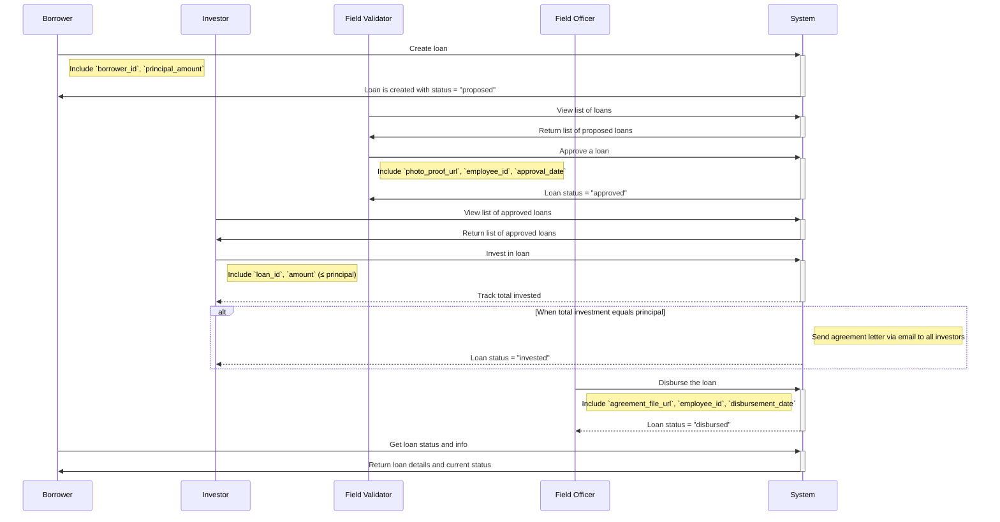

# amf-loan-service

```mermaid
sequenceDiagram
    participant Borrower
    participant Investor
    participant Validator as Field Validator
    participant Officer as Field Officer
    participant System

    Borrower->>+System: Create loan
    Note right of Borrower: Include `borrower_id`, `principal_amount`
    System->>-Borrower: Loan is created with status = "proposed"

    Validator->>+System: View list of loans
    System->>-Validator: Return list of proposed loans

    Validator->>+System: Approve a loan
    Note right of Validator: Include `photo_proof_url`, `employee_id`, `approval_date`
    System->>-Validator: Loan status = "approved"

    Investor->>+System: View list of approved loans
    System->>-Investor: Return list of approved loans

    Investor->>+System: Invest in loan
    Note right of Investor: Include `loan_id`, `amount` (≤ principal)
    System-->>-Investor: Track total invested

    alt When total investment equals principal
        Note right of System: Send agreement letter via email to all investors
        System-->>Investor: Loan status = "invested"
    end

    Officer->>+System: Disburse the loan
    Note right of Officer: Include `agreement_file_url`, `employee_id`, `disbursement_date`
    System-->>-Officer: Loan status = "disbursed"

    Borrower->>+System: Get loan status and info
    System->>-Borrower: Return loan details and current status
```
